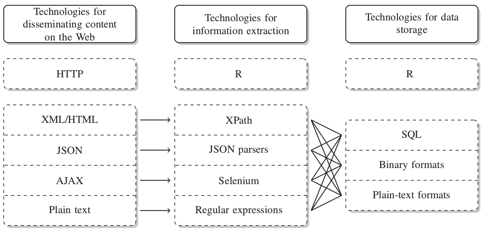
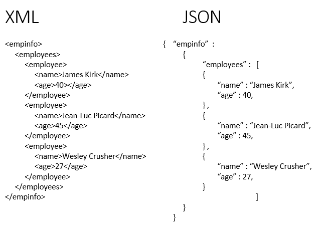
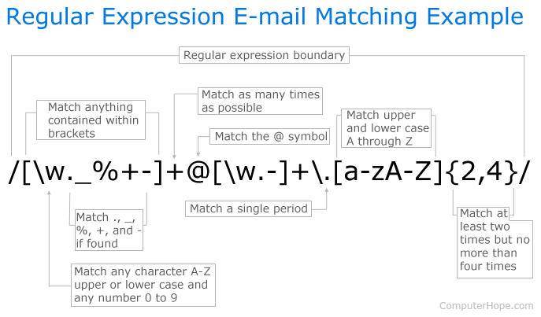
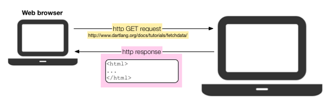
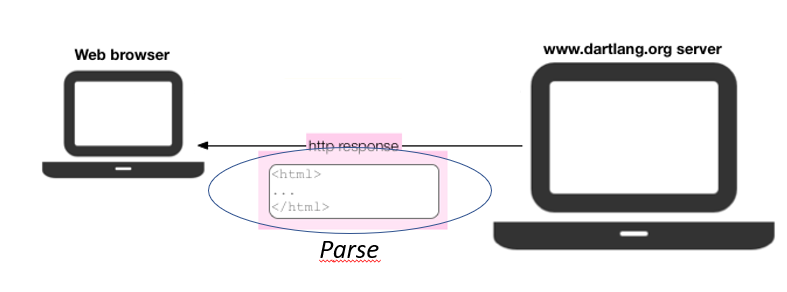
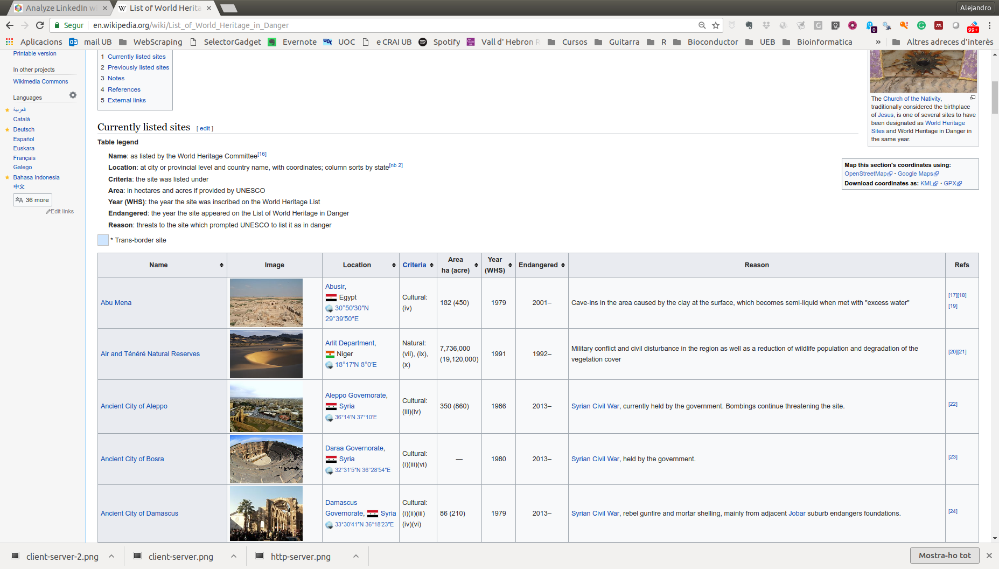
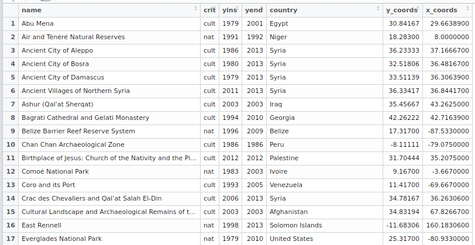
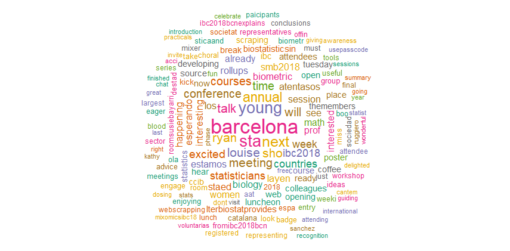
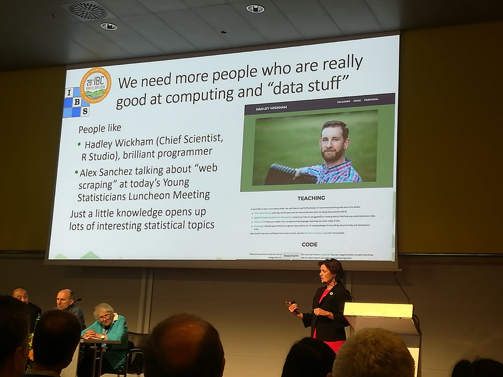

```{r setLicense, child = 'license.Rmd'}
```

We need data, ... and the web is full of it
===========================================

- As *statisticians* (or is it as *data scientists*?) our work relies on having the appropriate data to work with.
- The web has plenty of data
    + In 2008, an estimated 154 million HTML tables (out of the 14.1 billion) contain 'high quality relational data'!!!
    + Hard to quantify how much more exists outside of HTML Tables, but there is an estimate of at least 30 million lists with 'high quality relational data'.
- *Getting data from the web* is the topic of this talk


What we (may) need to learn to get data from the web
====================================================

<!--
- Areas that are important for data collection on the Web with R
-->
- Technologies that allow the *distribution of content on the Web*.
- Techniques & Tools for *collecting* (as opposite to distributing) data from the web.
- In the way to acquiring these abilites we may learn many useful things that don't necessarily have to do with web scraping such as:
    + HTML/CSS for creating web -and non web- pages (html is standard knitR output)
    + XML for sharing many types of data (also pdf, excel or epub)
    + Regular expressions for describing patterns in strings.
    + A variety of text mining and other interesting topics, such as "Sentiment Analysis" for analyzing data from Twitter, Linkedin etc.

Technologies for disseminating, extracting, and storing web data
=============================================================

<br>
<div align="center"> 
  
</div>


Technologies (1): HTML
=======================

<div align="center"> 
  
</div>

- **H**ypertext **M**arkup **L**anguage (HTML) is the language that all browsers understand.
- Not a dedicated data storage format but 
- First option for containing information we look for.
- A minimum understanding of html required 

Technologies (2)
==================

<div align="center"> 
  
</div>

- CSS is the language for describing the presentation of Web pages, including colors, layout, and fonts. 
- It allows one to adapt the presentation to different types of devices, such as large screens, small screens, or printers. 
- CSS is independent of HTML and can be used with any XML-based markup language.

Technologies (3): XML
=======================

<div align="center"> 
  
</div>

- E**X**tensible **M**arkup **L**anguage or XML is one of the most popular formats for exchanging data over the Web.
- XML is "just" data wrapped in user-defined tags. 
- The user-defined tags **make XML much more flexible** for storing data than HTML.

Technologies (4): JSON
=======================

<div align="center"> 
  
</div>

- JavaScript Object Notation or JSON
- JSON is a lightweight data-interchange format
- JSON is language independent but uses javascript syntax
- JSON is a syntax for storing and exchanging data.
- JSON is an easier-to-use alternative to XML


Technologies (5) XML vs JSON
=============================

<br>

<div align="center"> 
  
</div>

Technologies (6): AJAX
=======================

<div align="center"> 
  
</div>

- AJAX = Asynchronous JavaScript And XML.
- AJAX is a group of technologies that uses a combination of:
    + A user built-in XMLHttpRequest object (to request data from a web server)
    + JavaScript and HTML DOM (to display or use the data)
    
- AJAX allows web pages to be updated asynchronously by exchanging data with a web server behind the scenes. 
- This means that it is possible to update parts of a web page, without reloading the whole page.

Technologies (7): Regular Expressions
======================================

<br>
<div align="center"> 
  
</div>

So what is web scraping?
========================

- Web scraping (web harvesting or web data extraction) is how we name computer software techniques for extracting information from websites.
    + See [Wikipedia](https://en.wikipedia.org/wiki/Web_scraping)

- Web scraping focuses on the *transformation of unstructured data* on the web, typically in web format such as HTML, XML or JSON, into *structured* data that can be stored and analyzed in a central local database or spreadsheet.
    + Instead of structured data, if using R, we can think of *[tidy](http://vita.had.co.nz/papers/tidy-data.pdf)* data.
    
Understanding web communication: http
=====================================

<div align="center"> 
  
</div>

- User/Client asks for information: **http request**
- Server returns the information **http response**
- Data acquisition may be performed at two levels
    + Requesting information directly from the server
    + Parsing the response emited by the server

Requesting & retrieving information directly 
=============================================

<div align="center"> 
  
</div>

- Information retrieval can be made directly 
    + in raw form through http GET requests
    + through an Application Programming Interface (API)
- There exist many APIs for retrieving data from "typical" places such as Twitter, Amazon, Linkedin, etc.
    + APIs require an authorization/user identification
- R packages 
    + `httr`, `Rcurl`
    + `tweeteR`, `Rlinkedin`

Parsing the server's response
===============================

<div align="center"> 
  
</div>

- Parser tools extract information from the response sent by the server to the browser.
- The response is usually an HTML / XML document.
- Parsers exploit the hierarchichal structure of HTML / XML to extract information and convert it into R objects
- R packages
    + `rvest`, `selectR`
    + `XML`, `xml2`


The R scraping toolkit
===========================

- Comparison of some popular R packages for data collection.

<div align="center"> 
  
</div>

Source: **RCrawler: An R package for parallel web crawling and scraping**. Salim Khalil & MohamedFakir. 
https://doi.org/10.1016/j.softx.2017.04.004


(1): Scraping web pages
=================================

- The "simplest" situation: 
1. Access a web site and select one or more pages
     - Either download the pages or work directly on the site
2. Locate the information desired in the page
3. Extract it into an R object

- This can be done with different packages. 
- A common choice  Hadley Wickam's `rvest` 
- but the example uses `XML` package by Duncan Temple Lang

Example 1: Mapping world  heritages in danger
=============================================

- This case study has been adapted from chapter 1 of the book [Automated Data Collection with R](http://www.r-datacollection.com/) (ADCR, from now on). 
- Its goal is not to be exhaustive but providing a first example of a situation where we obtain and analyze data from the web.
- The goal is to tabulate and plot a list of endangered sites available in  [https://en.wikipedia.org/wiki/List_of_World_Heritage_in_Danger](https://en.wikipedia.org/wiki/List_of_World_Heritage_in_Danger).
- We proceed as follows:

1. Go to the web and locate the desired information
2. Download the pages (here, HTML document)
2. Extract HTML table into an R object
3. Clean the data and build a data.frame
4. Plot and analyze

** See the complete analysis file in the demos folder.**

** See lesson "WebScrapping-1b-Parsing HTML" in the Summer School folder** for an example that uses `rvest`

Example 1a: Wikipedia page
=============================================

<div align="center"> 
  
</div>

Example 1b: Locate desired table
=============================================

<div align="center"> 
  
</div>

Example 1c: R code
=============================================

```{r eval = FALSE}
# load packages
library(stringr); library(XML); library(maps)
#--- parsing from locally stored HTML file
heritage_parsed <- htmlParse("worldheritagedanger.htm")
#--- Extract table from web page and select desired table
danger_table <- readHTMLTable(heritage_parsed, stringsAsFactors = FALSE, which = 2) 
#--- select and rename columns
danger_table <- danger_table[,c(1,3,4,6,7)]
colnames(danger_table) <- c("name","locn","crit","yins","yend")
#--- Clean data
danger_table$crit <- ifelse(str_detect(danger_table$crit, "Natural")==T, "nat", "cult")
# cleanse years
danger_table$yins <- as.numeric(danger_table$yins)
danger_table$yend <- as.numeric(unlist(str_extract_all(danger_table$yend, "[[:digit:]]{4}$")))
#--- get countries
reg <- "[[:alpha:] ]+(?=[[:digit:]])"
danger_table$country <- str_extract(danger_table$locn , reg) 
#--- get coordinates
reg_y <- "[/][ -]*[[:digit:]]*[.]*[[:digit:]]*[;]"
reg_x <- "[;][ -]*[[:digit:]]*[.]*[[:digit:]]*"
danger_table$y_coords <- as.numeric(str_sub(str_extract(danger_table$locn, reg_y), 3, -2))
danger_table$x_coords <-  as.numeric(str_sub(str_extract(danger_table$locn, reg_x), 3, -1))
#--- plot endangered heritage sites
par(oma=c(0,0,0,0)); par(mar=c(0,0,0,0))
pch <- ifelse(danger_table$crit == "nat", 19, 2)
map("world", col = "darkgrey", lwd = .5, mar = c(0.1,0.1,0.1,0.1))
points(danger_table$x_coords, danger_table$y_coords, pch = pch, col = "black", cex = .8)
box()
```

Example 1d: We have an R data frame
=============================================

<div align="center"> 
  
</div>


Example 1e: And now the plot
=============================================

<div align="center"> 
  
</div>

    
Example 2a: Sentiment Analysis from Twitter 
============================================

- A typical information extraction process may be the following
1. Extract tweets and followers from the Twitter website with R
and the `twitteR` package.
2. Clean text by removing punctuations, numbers, hyperlinks and stop words.
- This will be followed by *a variety* of possible analyses:
3. Build a term-document matrix and make a Word Cloud.
4. Analyse topics with the `topicmodels` package.
5. Analyse sentiment with the `sentiment140` package.
6. Analyse following/followed and retweeting relationships with the `igraph` package

**See lesson "WebScrapping-3-Scraping_Twitter_for_Sentiment_Analysis" in the demos folder**

Example 2b: Twitter Code for scraping \#IBC2018BCN 
===============================================
```{r eval=FALSE}
### --- load packages
library(plyr); library(stringr);library(twitteR); library(tm); library(wordcloud)
## ----You may put your real keys in a non-accessible file-----------------
## source("twitterKeys.R") # Do not put thhis file in github (exclued it with .gitignore)
setup_twitter_oauth(consumer_key = twitter_key, consumer_secret = twitter_secret,
                    access_token= access_token, access_secret=access_secret)
# (1) choose direct authentication and answer "Yes"

## ------------------------------------------------------------------------
myTweets<- searchTwitter("#IBC2018BCN", n=200)
save(myTweets, file="myTweets.Rda")

## ----regexClean----------------------------------------------------------
showTweets <- TRUE
if (!exists("myTweets")) load("myTweets.Rda")
head(tweets.text)
tweets.text <- sapply(myTweets, function(x) x$getText())
tweets.text <- gsub("@\\w+", "", tweets.text) # Replace @UserName
tweets.text <- gsub("[[:punct:]]", "", tweets.text) # Remove punctuation
tweets.text <- gsub("http\\w+", "", tweets.text) # Remove links
tweets.text <- gsub("[ |\t]{2,}", "", tweets.text) # Remove tabs
tweets.text<-  gsub( '[^A-z0-9_]', ' ', tweets.text) # remove codes that are neither characters nor digits
tweets.text <- tolower(tweets.text) # Set characters to lowercase
tweets.text <- gsub("rt", "", tweets.text) # Replace blank space
tweets.text <- gsub("^ ", "", tweets.text) # Remove blank spaces at the beginning
tweets.text <- gsub(" $", "", tweets.text) # Remove blank spaces at the end
head(tweets.text)

## ---Use tm package to have a list of stopwords
require("tm")
tweets.text.corpus <- Corpus(VectorSource(tweets.text)) #create corpus
#clean up by removing stop words
tweets.text.corpus <- tm_map(tweets.text.corpus, function(x) removeWords(x, stopwords()))
head(tweets.text.corpus)

#--- generate wordcloud
require(wordcloud)
wordcloud(tweets.text.corpus, min.freq = 2, scale=c(7,0.5),
          colors=brewer.pal(8, "Dark2"),random.color= TRUE, random.order = FALSE, 
          max.words = 200)
```

Example 2c: A nice wordcloud from your tweets
=============================================
<div align="center"> 
  
</div>


See many more examples in the web
=============================

- These slides have been prepared based on multiple sources: websites, blogs, courses. While it is hard to cite them all I wish to acknowledge those sources that have been particularly useful.

    + [Tutorial-R-web-data](https://github.com/gastonstat/tutorial-R-web-data), by Gaston Sanchez
    + [Text Mining, Scraping and Sentiment Analysis with R](https://www.udemy.com/r-social-media-mining-scraping-with-twitter/) Udemy.
    + [Working with Web Data in R](https://www.datacamp.com/courses/working-with-web-data-in-r) Datacamp Course

- There are also multiple tutorials such as ...

    +  [Beginner's Guide on Web Scraping in R (using rvest) with hands-on example](https://www.analyticsvidhya.com/blog/2017/03/beginners-guide-on-web-scraping-in-r-using-rvest-with-hands-on-knowledge/)
    +  [Examples of Web Scraping with R](http://www.programmingr.com/examples/examples-web-scraping-r/)
    +  [Web Scraping Exercises](https://www.r-bloggers.com/web-scraping-exercises/)

Thanks for your attention
===========================
<div align="center"> 
  
</div>

