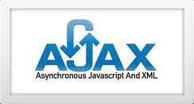

```{r setLicense, child = 'license.Rmd'}
```

```{r disclaimer, child = 'disclaimer.Rmd'}
```

We need data, ... and the web is full of it
===========================================

- As *statisticians* (or is it as *data scientists*?) our work relies on having the appropriate data to work with.
- The web has plenty of data
    + In 2008, an estimated 154 million HTML tables (out of the 14.1 billion) contain 'high quality relational data'!!!
    + Hard to quantify how much more exists outside of HTML Tables, but there is an estimate of at least 30 million lists with 'high quality relational data'.
- Accessing the data in the web is the topic of this talk


What we (may) need to learn to scrap the web
============================================

- Areas that are important for data collection on the Web with R
- The technologies that allow the *distribution of content on the Web*.
- The appropriate technique / tools for *collecting* (as opposite to distributing) data from the web.

- In the way to acquiring these abilites we may learn many useful things that don't necessarily have to do with web scraping such as:
    + HTML/CSS for creating web -and non web- pages (html is standard knitR output)
    + XML for sharing many types of data (also pdf, excel or epub)
    + Regular expressions and text mining techniques (for analyzing tweeter or facebook downloads)

Understanding web browsing (1) 
===========================

<div align="center"> 
  
</div>

- The user **requests** information through the browser
- The server **responds** by sending the information required.

- Data acquisition may be performed at two levels
    + Requesting information directly from the server
    + Parsing the response emited by the server

Understanding web browsing (2)
===========================

- Requesting information directly from the server

<div align="center"> 
  
</div>

- Retreiver tools capture the information which may be
     + Directly processed if sent by an API
     + Analyzed and processed if in raw form
        

Understanding web browsing (3)
===========================
- Parsing the response emited by the server

<div align="center"> 
  
</div>

- Parser tools extract information from the response sent by the server to the browser


Technologies for disseminating, extracting, and storing web data
=================================================================

<div align="center"> 
  
</div>

The R scraping toolkit
===========================


Technologies (1): HTML
=======================

<div align="center"> 
  
</div>

- **H**ypertext **M**arkup **L**anguage (HTML) is the language that all browsers understand.
- Not a dedicated data storage format but 
- First option for containing information we look for.
- A minimum understanding of html required 

Technologies (2): XML
=======================

<div align="center"> 
  
</div>

- E**X**tensible **M**arkup **L**anguage or XML is one of the most popular formats for exchanging data over the Web.
- XML is “just” data wrapped in user-defined tags. 
- The user-defined tags **make XML much more flexible** for storing data than HTML.

Technologies (3): JSON
=======================

<div align="center"> 
  
</div>

- JavaScript Object Notation or JSON
- JSON is a lightweight data-interchange format
- JSON is language independent but uses javascript syntax
- JSON is a syntax for storing and exchanging data.
- JSON is an easier-to-use alternative to XML

Technologies (4): AJAX
=======================

<div align="center"> 
  
</div>

- AJAX = Asynchronous JavaScript And XML.
- AJAX is a group of technologies that uses a combination of:
    + A user built-in XMLHttpRequest object (to request data from a web server)
    + JavaScript and HTML DOM (to display or use the data)
    
- AJAX allows web pages to be updated asynchronously by exchanging data with a web server behind the scenes. 
- This means that it is possible to update parts of a web page, without reloading the whole page.


So what is web scraping?
========================

- Web scraping (web harvesting or web data extraction) is how we name computer software techniques for extracting information from websites.
    + See [Wikipedia](https://en.wikipedia.org/wiki/Web_scraping)

- Web scraping focuses on the *transformation of unstructured data* on the web, typically in web format such as HTML, XML or JSON, into *structured* data that can be stored and analyzed in a central local database or spreadsheet.
    + Instead of structured data, if using R, we can think of *[tidy](http://vita.had.co.nz/papers/tidy-data.pdf)* data.
    
Web scraping and R
==================

- Web scraping has been developed independently of R. <br>See for example:
    + [Scraping the Web for Arts and Humanities](https://www.essex.ac.uk/ldev/documents/going_digital/scraping_book.pdf)
    + [Introduction to Web Scraping using Scrapy and Postgres](http://newcoder.io/scrape/)
    
- There is a lot of information on scraping using python
- However if you feel comfortable working with R it is possible that you can absorbe easier and faster some of the the vast amount of resources for getting data from the web with R.

The scrapping process
=============================
<div align="center"> 
  
</div>
    


References
===========
- [Automated Data Collection from the Web with R](http://www.r-datacollection.com/), by Munzer, Rubba, Meisner & Nyhulis. Wiley.
- [XML and Web Technologies for Data Science with R](http://www.rxmlwebtech.org/). Deborah Nolan & Duncan Temple Lang. UseR!
- [Introduction to Data Technologies](https://www.stat.auckland.ac.nz/~paul/ItDT/itdt-2013-03-26.pdf). Duncan Murdoch.

Resources
==========
- [Getting Data from the Web with R](https://github.com/gastonstat/tutorial-R-web-data), by Gaston Sánchez.
- [Web scraping for the humanities and social sciences](http://quantifyingmemory.blogspot.co.uk/2014/02/web-scraping-basics.html), Rolf Fredheim and Aiora Zabala.
- [Web Scraping with R](http://cos.name/wp-content/uploads/2013/05/Web-Scraping-with-R-XiaoNan.pdf), by Xiao Nan.
- [R-bloggers posts on *Web Scraping*](http://www.r-bloggers.com/?s=web+scraping)
- And see also [CRAN Web Services and Technologies task view](https://cran.r-project.org/web/views/WebTechnologies.html)


Case Study: World heritage sites in danger
========================================================

- The UNESCO is an organization of the United Nations which, among other things, fights for the preservation of the world's natural and cultural heritage. 
- As November 2013 there  are 981 heritage sites, most of which of are man-made like the Pyramids of Giza, but also natural phenomena like the Great Barrier Reef are listed. 
- Unfortunately, some of the awarded places are threatened by human intervention. 
- These are the questions that we want to examine in this first case study.
    + *Which sites are threatened and where are they located?*
    + *Are there regions in the world where sites are more endangered than in others?* 
    + *What are the reasons that put a site at risk?* 
    
Working through the case study with R
=====================================

- The list of heritage sites in danger can be found in [The Wikipedia](https://en.wikipedia.org/wiki/List_of_World_Heritage_in_Danger)
- The R code for answering the questions posed is available at files: 
    + `ch-1-introduction.Rmd`, `ch-1-introduction.R`, `ch-1-introduction.html`.
- Run this code step by step without worrying too much at what each instruction does
    + This wil give you a grasp of how a web scraping project works.
    + The meaning of each step will be clear at the end of the module.
    


