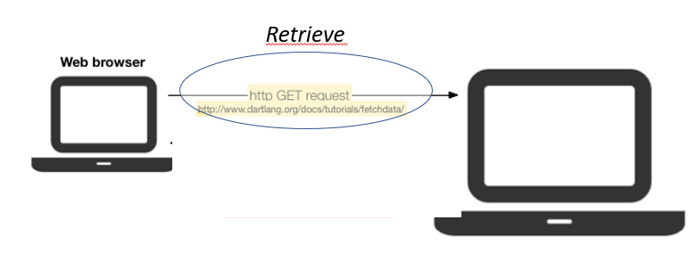
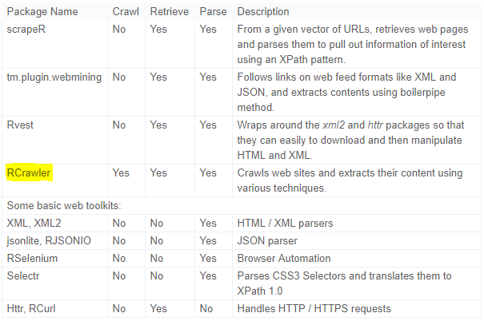

```{r setLicense, child = 'license.Rmd'}
```

We need data, ... and the web is full of it
===========================================

- As *statisticians* (or is it as *data scientists*?) our work relies on having the appropriate data to work with.
- The web has plenty of data
    + In 2008, an estimated 154 million HTML tables (out of the 14.1 billion) contain 'high quality relational data'!!!
    + Hard to quantify how much more exists outside of HTML Tables, but there is an estimate of at least 30 million lists with 'high quality relational data'.
- *Getting data from the web* is the topic of this talk


What we (may) need to learn to get data from the web
====================================================

<!--
- Areas that are important for data collection on the Web with R
-->
- Technologies that allow the *distribution of content on the Web*.
- Techniques & Tools for *collecting* (as opposite to distributing) data from the web.
- In the way to acquiring these abilites we may learn many useful things that don't necessarily have to do with web scraping such as:
    + HTML/CSS for creating web -and non web- pages (html is standard knitR output)
    + XML for sharing many types of data (also pdf, excel or epub)
    + Regular expressions for describing patterns in strings.
    + A variety of text mining and other interesting topics, such as "Sentiment Analysis" for analyzing data from Twitter, Linkedin etc.

Understanding web communication: http
=====================================

<div align="center"> 
  
</div>

- User/Client asks for information: **http request**
- Server returns the information **http response**
- Data acquisition may be performed at two levels
    + Requesting information directly from the server
    + Parsing the response emited by the server

Requesting & retrieving information directly 
=============================================

<div align="center"> 
  
</div>

- Information retrieval can be made directly 
    + in raw form through http GET requests
    + through an Application Programming Interface (API)
- There exist many APIs for retrieving data from "typical" places such as Twitter, Amazon, Linkedin, etc.
    + APIs require an authorization/user identification
- R packages 
    + `httr`, `Rcurl`
    + `tweeteR`, `Rlinkedin`

Parsing the server's response
===============================

<div align="center"> 
  
</div>

- Parser tools extract information from the response sent by the server to the browser.
- The response is usually an HTML / XML document.
- Parsers exploit the hierarchichal structure of HTML / XML to extract information and convert it into R objects
- R packages
    + `rvest`, `selectR`
    + `XML`, `xml2`


The R scraping toolkit
===========================

- Comparison of some popular R packages for data collection.

<div align="center"> 
  
</div>

Source: **RCrawler: An R package for parallel web crawling and scraping**. Salim Khalil & MohamedFakir. 
https://doi.org/10.1016/j.softx.2017.04.004

(1): Scraping web pages
=================================

- The "simplest" situation: 
1. Access a web site and select one or more pages
     - Either download the pages or work directly on the site
2. Locate the information desired in the page
3. Extract it into an R object

- This can be done with different packages. 
- A common choice : Hadley Wickam's `rvest` 

Example 1: Mapping world  heritages in danger
=============================================

- This case study has been adapted from chapter 1 of the book [Automated Data Collection with R](http://www.r-datacollection.com/) (ADCR, from now on). 
- Its goal is not to be exhaustive but providing a first example of a situation where we obtain and analyze data from the web.
- The goal is to tabulate and plot a list of endangered sites available in  [https://en.wikipedia.org/wiki/List_of_World_Heritage_in_Danger](https://en.wikipedia.org/wiki/List_of_World_Heritage_in_Danger).
- We proceed as follows:

1. Go to the web and locate the desired information
2. Download the pages (here, HTML document)
2. Extract HTML table into an R object
3. Clean the data and build a data.frame
4. Plot and analyze

** See the complete analysis file in the demos folder.**

Example 1a: Wikipedia page
=============================================

<div align="center"> 
  
</div>

Example 1b: Locate desired table
=============================================

<div align="center"> 
  
</div>

Example 1c: R code
=============================================

```{r eval = FALSE}
# load packages
library(stringr); library(XML); library(maps)
#--- parsing from locally stored HTML file
heritage_parsed <- htmlParse("worldheritagedanger.htm")
#--- Extract table from web page and select desired table
danger_table <- readHTMLTable(heritage_parsed, stringsAsFactors = FALSE, which = 2) 
#--- select and rename columns
danger_table <- danger_table[,c(1,3,4,6,7)]
colnames(danger_table) <- c("name","locn","crit","yins","yend")
#--- Clean data
danger_table$crit <- ifelse(str_detect(danger_table$crit, "Natural")==T, "nat", "cult")
# cleanse years
danger_table$yins <- as.numeric(danger_table$yins)
danger_table$yend <- as.numeric(unlist(str_extract_all(danger_table$yend, "[[:digit:]]{4}$")))
#--- get countries
reg <- "[[:alpha:] ]+(?=[[:digit:]])"
danger_table$country <- str_extract(danger_table$locn , reg) 
#--- get coordinates
reg_y <- "[/][ -]*[[:digit:]]*[.]*[[:digit:]]*[;]"
reg_x <- "[;][ -]*[[:digit:]]*[.]*[[:digit:]]*"
danger_table$y_coords <- as.numeric(str_sub(str_extract(danger_table$locn, reg_y), 3, -2))
danger_table$x_coords <-  as.numeric(str_sub(str_extract(danger_table$locn, reg_x), 3, -1))
#--- plot endangered heritage sites
par(oma=c(0,0,0,0)); par(mar=c(0,0,0,0))
pch <- ifelse(danger_table$crit == "nat", 19, 2)
map("world", col = "darkgrey", lwd = .5, mar = c(0.1,0.1,0.1,0.1))
points(danger_table$x_coords, danger_table$y_coords, pch = pch, col = "black", cex = .8)
box()
```

Example 1: R data frame
=============================================

<div align="center"> 
  
</div>


Example 1: Plot
=============================================

<div align="center"> 
  
</div>

    
Example (2): Sentiment Analysis from Tweeter 
============================================

- A typical information extraction process may be the following
1. Extract tweets and followers from the Twitter website with R
and the `twitteR` package.
2. Clean text by removing punctuations, numbers, hyperlinks and stop words.
- This will be followed by *a variety* of possible analyses:
3. Build a term-document matrix and make a Word Cloud.
4. Analyse topics with the `topicmodels` package.
5. Analyse sentiment with the `sentiment140` package.
6. Analyse following/followed and retweeting relationships with the `igraph` package


```{r disclaimer, child = 'disclaimer.Rmd'}
```
