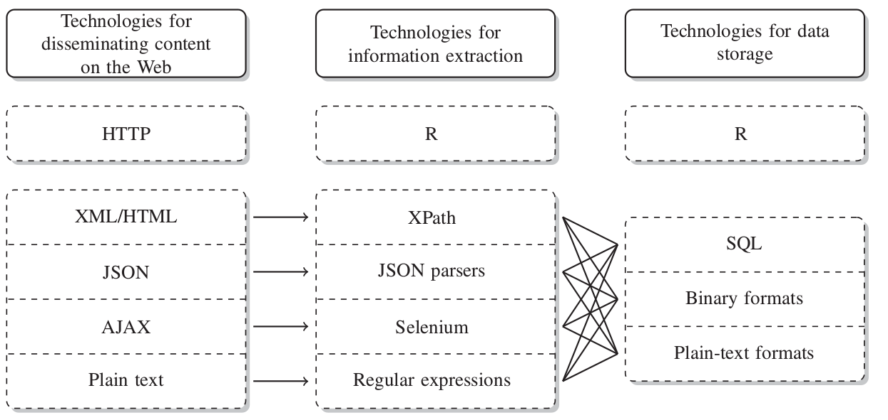
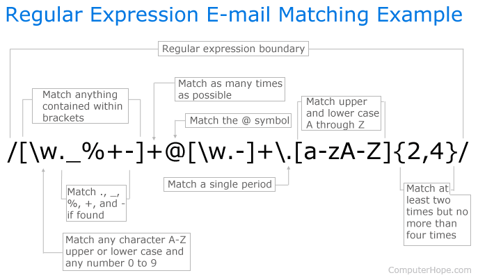
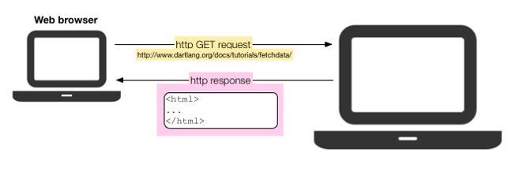
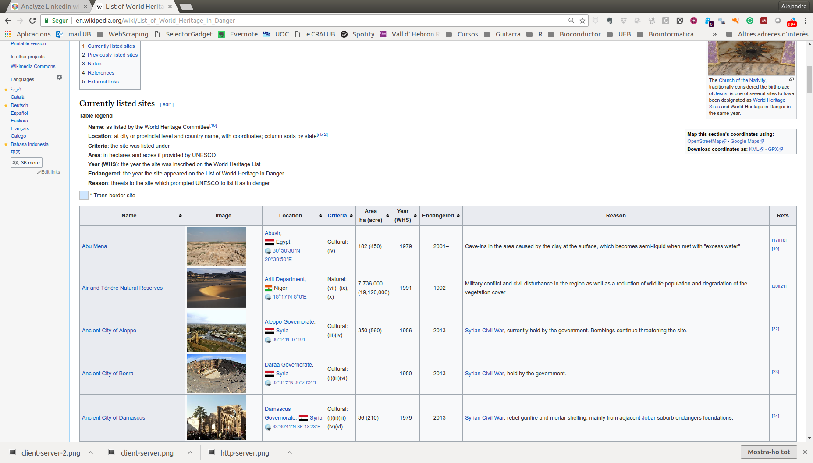
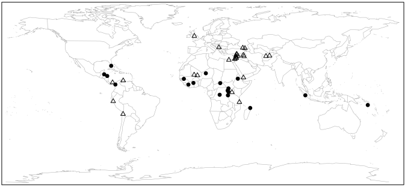

```{r setLicense, child = 'license.Rmd'}
```

```{r disclaimer, child = 'disclaimer.Rmd'}
```

Objectives and Competences
==========================
- Become familiar with technologies for content dissemination on the web Information extraction from web-formatted data.
- Become familiar -*that is, know how to do it*- with the different tasks involved in web scraping.
- Learn how to set up and execute successful web scraping projects (making them as automatic, robust and error-resistant as possible).


Contents
=========
0. Introduction to web technologies & Overview
1. The basics: HTML and CSS
2. Text extraction with regular expressions
3. Using APIs to get data. Scrapping twiter.
4. XML basics. Parsing XML
5. Handling JSON data


We need data, ... and the web is full of it
===========================================

- As *statisticians* (or is it as *data scientists*?) our work relies on having the appropriate data to work with.
- The web has plenty of data
    + In 2008, an estimated 154 million HTML tables (out of the 14.1 billion) contain 'high quality relational data'!!!
    + Hard to quantify how much more exists outside of HTML Tables, but there is an estimate of at least 30 million lists with 'high quality relational data'.
- Accessing the data in the web is the topic of this course

What we need to know
====================

- Technologies that allow the *distribution of content on the Web*.
- Techniques & Tools for *collecting* (as opposite to distributing) data from the web.
- In the way to acquiring these abilites we may learn many useful things that don't necessarily have to do with web scraping such as:
    + HTML/CSS for creating web -and non web- pages (html is standard knitR output)
    + XML for sharing many types of data (also pdf, excel or epub)
    + Regular expressions for describing patterns in strings.
    + A variety of text mining and other interesting topics, such as "Sentiment Analysis" for analyzing data from Twitter, Linkedin etc.

Technologies for disseminating, extracting, and storing web data
=============================================================

<div align="center"> 
  
</div>

Technologies (1): HTML
=======================

<div align="center"> 
  
</div>

- **H**ypertext **M**arkup **L**anguage (HTML) is the language that all browsers understand.
- Not a dedicated data storage format but 
- First option for containing information we look for.
- A minimum understanding of html required 

Technologies (2)
==================

<div align="center"> 
  
</div>

- CSS is the language for describing the presentation of Web pages, including colors, layout, and fonts. 
- It allows one to adapt the presentation to different types of devices, such as large screens, small screens, or printers. 
- CSS is independent of HTML and can be used with any XML-based markup language.

Technologies (3): XML
=======================

<div align="center"> 
  
</div>

- E**X**tensible **M**arkup **L**anguage or XML is one of the most popular formats for exchanging data over the Web.
- XML is "just" data wrapped in user-defined tags. 
- The user-defined tags **make XML much more flexible** for storing data than HTML.

Technologies (4): JSON
=======================

<div align="center"> 
  
</div>

- JavaScript Object Notation or JSON
- JSON is a lightweight data-interchange format
- JSON is language independent but uses javascript syntax
- JSON is a syntax for storing and exchanging data.
- JSON is an easier-to-use alternative to XML


Technologies (5) XML vs JSON
=============================

<br>

<div align="center"> 
  
</div>

Technologies (6): AJAX
=======================

<div align="center"> 
  
</div>

- AJAX = Asynchronous JavaScript And XML.
- AJAX is a group of technologies that uses a combination of:
    + A user built-in XMLHttpRequest object (to request data from a web server)
    + JavaScript and HTML DOM (to display or use the data)
    
- AJAX allows web pages to be updated asynchronously by exchanging data with a web server behind the scenes. 
- This means that it is possible to update parts of a web page, without reloading the whole page.

Technologies (7): Regular Expressions
======================================

<br>
<div align="center"> 
  
</div>


So what is web scraping?
========================

- Web scraping (web harvesting or web data extraction) is how we name computer software techniques for extracting information from websites.
    + See [Wikipedia](https://en.wikipedia.org/wiki/Web_scraping)

- Web scraping focuses on the *transformation of unstructured data* on the web, typically in web format such as HTML, XML or JSON, into *structured* data that can be stored and analyzed in a central local database or spreadsheet.
    + Instead of structured data, if using R, we can think of *[tidy](http://vita.had.co.nz/papers/tidy-data.pdf)* data.

Understanding web communication: http
=====================================

<div align="center"> 
  
</div>

- User/Client asks for information: **http request**
- Server returns the information **http response**
- Data acquisition may be performed at two levels
    + Requesting information directly from the server
    + Parsing the response emited by the server

Requesting & retrieving information directly 
=============================================

<div align="center"> 
  
</div>

- Information retrieval can be made directly 
    + in raw form through http GET requests
    + through an Application Programming Interface (API)
- There exist many APIs for retrieving data from "typical" places such as Twitter, Amazon, Linkedin, etc.
    + APIs require an authorization/user identification
- R packages 
    + `httr`, `Rcurl`
    + `tweeteR`, `Rlinkedin`

Parsing the server's response
===============================

<div align="center"> 
  
</div>

- Parser tools extract information from the response sent by the server to the browser.
- The response is usually an HTML / XML document.
- Parsers exploit the hierarchichal structure of HTML / XML to extract information and convert it into R objects
- R packages
    + `rvest`, `selectR`
    + `XML`, `xml2`


The R scraping toolkit
===========================

- Comparison of some popular R packages for data collection.

<div align="center"> 
  
</div>

Source: **RCrawler: An R package for parallel web crawling and scraping**. Salim Khalil & MohamedFakir. 
https://doi.org/10.1016/j.softx.2017.04.004


Web scraping and R
===================

- Web scraping has been developed independently of R. <br>See for example:
    + [Scraping the Web for Arts and Humanities](https://www.essex.ac.uk/ldev/documents/going_digital/scraping_book.pdf)
    + [Introduction to Web Scraping using Scrapy and Postgres](http://newcoder.io/scrape/)
    
- There is a lot of information on scraping using python
- However if you feel comfortable working with R it is possible that you can absorbe easier and faster some of the the vast amount of resources for getting data from the web with R.

The scrapping process
=============================
<div align="center"> 
  
</div>

<!--

Methodology
============
- Combine theory and practice
    + Information about technologies and how-to’s will be provided and introduced in class.
    + Techniques for accessing and extracting infformation will be introduced and tested in class.
- From the very beginning you should conceive a web scraping project. 
     + We will devote (some) time to implement your own project and discuss issues that may appear.
     
Evaluation
===========
- There is no examen.
- You must suggest and implement a web scraping project.
- Scoring will be based on
    + Project completeness and complexity.
    + Appropriate use of technologies and tools discussed in class.
    + Robustness of the elaborated product.

-->


Case Study 1: World heritage sites in danger
========================================================

- The UNESCO is an organization of the United Nations which, among other things, fights for the preservation of the world's natural and cultural heritage. 
- As November 2013 there  are 981 heritage sites, most of which of are man-made like the Pyramids of Giza, but also natural phenomena like the Great Barrier Reef are listed. 
- Unfortunately, some of the awarded places are threatened by human intervention. 
- These are the questions that we want to examine in this first case study.
    + *Which sites are threatened and where are they located?*
    + *Are there regions in the world where sites are more endangered than in others?* 
    + *What are the reasons that put a site at risk?* 
    
Working through the case study with R
=====================================

- This case study has been adapted from chapter 1 of the book [Automated Data Collection with R](http://www.r-datacollection.com/) (ADCR, from now on). 
- Its goal is not to be exhaustive but providing a first example of a situation where we obtain and analyze data from the web.
- The goal is to tabulate and plot a list of endangered sites available in  [https://en.wikipedia.org/wiki/List_of_World_Heritage_in_Danger](https://en.wikipedia.org/wiki/List_of_World_Heritage_in_Danger).
- We proceed as follows:

1. Go to the web and locate the desired information
2. Download the pages (here, HTML document)
2. Extract HTML table into an R object
3. Clean the data and build a data.frame
4. Plot and analyze

<!--
**See the complete analysis file in the demos folder.**

**See lesson "WebScrapping-1b-Parsing HTML" in the Summer School folder** for an example that uses `rvest`
-->

Example 1a: Wikipedia page
=============================================

<div align="center"> 
  
</div>

Example 1b: Locate desired table
=============================================

<div align="center"> 
  
</div>

Example 1c: R code
=============================================

```{r eval = FALSE}
# load packages
library(stringr); library(XML); library(maps)
#--- parsing from locally stored HTML file
heritage_parsed <- htmlParse("worldheritagedanger.htm")
#--- Extract table from web page and select desired table
danger_table <- readHTMLTable(heritage_parsed, stringsAsFactors = FALSE, which = 2) 
#--- select and rename columns
danger_table <- danger_table[,c(1,3,4,6,7)]
colnames(danger_table) <- c("name","locn","crit","yins","yend")
#--- Clean data
danger_table$crit <- ifelse(str_detect(danger_table$crit, "Natural")==T, "nat", "cult")
# cleanse years
danger_table$yins <- as.numeric(danger_table$yins)
danger_table$yend <- as.numeric(unlist(str_extract_all(danger_table$yend, "[[:digit:]]{4}$")))
#--- get countries
reg <- "[[:alpha:] ]+(?=[[:digit:]])"
danger_table$country <- str_extract(danger_table$locn , reg) 
#--- get coordinates
reg_y <- "[/][ -]*[[:digit:]]*[.]*[[:digit:]]*[;]"
reg_x <- "[;][ -]*[[:digit:]]*[.]*[[:digit:]]*"
danger_table$y_coords <- as.numeric(str_sub(str_extract(danger_table$locn, reg_y), 3, -2))
danger_table$x_coords <-  as.numeric(str_sub(str_extract(danger_table$locn, reg_x), 3, -1))
#--- plot endangered heritage sites
par(oma=c(0,0,0,0)); par(mar=c(0,0,0,0))
pch <- ifelse(danger_table$crit == "nat", 19, 2)
map("world", col = "darkgrey", lwd = .5, mar = c(0.1,0.1,0.1,0.1))
points(danger_table$x_coords, danger_table$y_coords, pch = pch, col = "black", cex = .8)
box()
```

Example 1d: We have an R data frame
=============================================

<div align="center"> 
  
</div>


Example 1e: And now the plot
=============================================

<div align="center"> 
  
</div>


References and resources
=========================
- [Automated Data Collection from the Web with R](http://www.r-datacollection.com/), by Munzer, Rubba, Meisner & Nyhulis. Wiley.
- [XML and Web Technologies for Data Science with R](http://www.rxmlwebtech.org/). Deborah Nolan & Duncan Temple Lang. UseR!
- [Introduction to Data Technologies](https://www.stat.auckland.ac.nz/~paul/ItDT/itdt-2013-03-26.pdf). Duncan Murdoch.

- [Getting Data from the Web with R](https://github.com/gastonstat/tutorial-R-web-data), by Gaston Sánchez.
- [Web scraping for the humanities and social sciences](http://quantifyingmemory.blogspot.co.uk/2014/02/web-scraping-basics.html), Rolf Fredheim and Aiora Zabala.
- [Web Scraping with R](http://cos.name/wp-content/uploads/2013/05/Web-Scraping-with-R-XiaoNan.pdf), by Xiao Nan.
- [R-bloggers posts on *Web Scraping*](http://www.r-bloggers.com/?s=web+scraping)
- And see also [CRAN Web Services and Technologies task view](https://cran.r-project.org/web/views/WebTechnologies.html)


