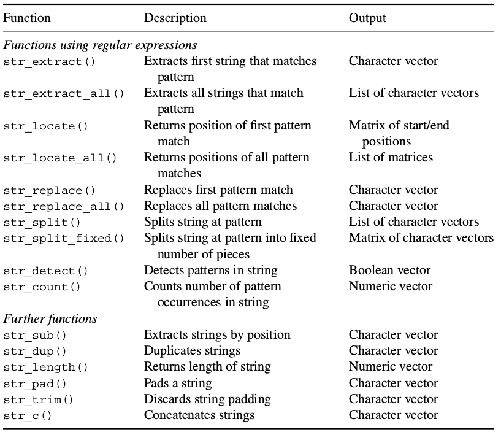

```{r setLicense, child = 'license.Rmd'}
```

```{r disclaimer, child = 'disclaimerStrings.Rmd'}
```

Introduction
=============

- Web scraping is about collecting information from the web.
- Sometimes this will be contained in tables or other well structured containers,
- But most of the times we need to gather relevant information from *heaps of unstructured textual data*.
- This is usually done in three steps
    1. Gather the unstructured text.
    2. Determine which recurrent *patterns* in the data are we looking for.
    3. Apply the patterns to the unstructured text to obtain the desired information.
- We focus on steps 2 and 3 and introduce **regular expressions** as the tool for optimally doing this processing.
- Regular expressions provide a syntax for systematically accessing and operating on text patterns.

When would one need regular expressions?
=======================================
- The example below shows a typical situation where regular expressions mat be useful: manipulating files by their names.
    + We are often faced with the problem of selecting/accessing a subset of files.
    + We can use string functions to extract certain (file)names, say all documents on a certain topic.
        * At a certain level standard string functions will be enough to describe the names we want to access: for example all files whose name includes the string  `dplyr`.
        * For more sophisticated extractions this will not be enough. Here is where regular expressions enter the game allowing to describe almost any pattern one can imagine.
- Regular expressions are throroughly used by system administrators to manage computer files.
- A different but related situation is when one whishes to extract meaningful (or "given") content from text.
    + Mining text to look for a certain type of expression
    + Mining twitter data
    
A simple example (1): files and datasets
==========================================
- We have selected a few files from:from [https://github.com/STAT545-UBC/STAT545-UBC.github.io](https://github.com/STAT545-UBC/STAT545-UBC.github.io), where you can find a good tutorial on regular expressions, and have compressed them into a zip file: `regexExample1.zip`.
- We wish to locate all the files which deal with the `dplyr` package. We assume that these are file with the string "dplyr" inside their name.
- To do this we proceed as follows:

1. List all files in the folder where you uncompressed `"regexExample1.zip"`

```{r}
setwd("regexExample1")
files <- list.files()
setwd("..")
# head(files)
```

A simple example (2): File selection
===================================

- We can use `grep()` function to identify files whose name contains the string "`dplyr`". 
- If we set the argument `value = TRUE`, `grep()` returns the matches, 
 

```{r}
grep("dplyr", files, value = TRUE)
```

- If, instead, we set `value = FALSE`,  `grep()` returns their indices. 

```{r}
grep("dplyr", files, value = FALSE)
```

More `grep` flavors
====================
- The `invert` argument let's you get everything BUT the pattern you specify. 

```{r}
grep("dplyr", files, invert=TRUE, value = FALSE)
```

- `grepl()` is a dimilar to `grep` but returns a logical vector. See [here](http://www.rdocumentation.org/packages/base/functions/grep) for more information. 

```{r}
grepl("dplyr", files)
```

So what are regular expressions?
=================================

- A *regular expression* is a special text string for describing a certain amount of text.
- This "certain amount of text" receives the formal name of *pattern*.
- A regular expression is a *pattern that describes a set of strings*.
- It is common to abbreviate the term "regular expression" as *regex*.
- Simply put, working with regular expressions is nothing more than *pattern matching*.

Forming regular expressions
=================================

- Regex patterns consist of a combination of *alphanumeric characters* as well as *special characters*.
    + e.g. [a-zA-Z0-9 .]*
- A regex pattern can be as simple as a single character.
- But it can also be formed by several characters with a more complex structure.
- Regular expressions are constructed from 3 types of components:
    + __*Literal characters*__ are matched only by the character itself.
    + __*Character classes*__, matched by any single member of the specified class
    + __*Modifers*__ that operate on literal characters, character classes, or combinations of the two.
    
String functions and patterns
=============================

- Notice that the enumeration above relies on two types of functions
    + Standard `base` R functions
    + Functions from the `stringr` package, developed for extending and simplifying R base functionalities.
- Information is available:
    + For base functions at:
[ENDMEMO/Regular Expressions in R](http://www.endmemo.com/program/R/grep.php)
    + For `stringr` at: [stringi regular expressions vignette](https://cran.r-project.org/web/packages/stringr/vignettes/regular-expressions.html)
- All the functions require a pattern to describe the set of strings on which they operate.
- Regular expressions _*are not the functions but the rules used to build the patterns*_.

Common Regex tasks
===================

- **identify** match to a pattern: 
    + `grep(..., value = FALSE)`, `grepl()`, 
    + `stringr::str_detect()`
- **extract** match to a pattern: 
    + `grep(..., value = TRUE)`, 
    + `stringr::str_extract()`, `stringr::str_extract_all()`     
- **locate** pattern within a string, i.e. give the start position of matched patterns. 
    + `regexpr()`, `gregexpr()`, 
    + `stringr::str_locate()`, `string::str_locate_all()`    

Common Regex tasks (continued)
===================    
    
- **replace** a pattern: 
    + `sub()`, `gsub()`, 
    + `stringr::str_replace()`, `stringr::str_replace_all()`     
- **split a string** using a pattern: 
    + `strsplit()`, 
    + `stringr::str_split()`     
    
Regular expression syntax
==========================

- Regular expressions typically specify *characters* or *character classes* to seek out, possibly with information about repeats and location within the string. 
- This is accomplished with the help of metacharacters that have specific meaning: 
    + `$ * + . ? [ ] ^ { } | ( ) \`. 
- In this section, we will introduce the basic building blocks of extended regular expressions as implemented in R. 
- The following string will serve as a running example:
```{r}
example.obj <- "1. A small sentence. - 2. Another tiny sentence."
```

Syntax (1): Exact character matching
==========================================

- At the most basic level *characters match characters*, even in regular expressions. 
- Thus, extracting a substring of a string will yield itself if present:
```{r}
require(stringr)
str_extract(example.obj, "small")
```
Otherwise, the function would return a missing value:
```{r}
 str_extract(example.obj, "banana")
```

`grep` can also be used to exctract a match but it returns the whol sentence matching the pattern.
```{r}
grep("small",  example.obj, value=TRUE)
```

The `str_whatever` functions
=============================
- The `stringr` package offers both `str_whatever()` and `str_whatever_all()` in many
instances. 
    + The former addresses the first instance of a matching string,
    + the latter accesses all instances.
- The syntax of all these functions is such that:
    + the character vector in question is the first element, 
    + the *regular expression* the second, and 
    + all possible additional values come after that.
    
```{r}
require(stringr)
str_extract_all(example.obj,"e")
```

`str_extract` vs `grep`
=============================

- Observe the different result:

```{r}
x <- c("apple", "banana", "pear")
str_extract(x, "an")
grep("an", x, value = TRUE)
```

- To obtain the same result as with grep one can use `str_detect`

```{r}
str_subset(x,"an")
```


Refining the search for a character (1) Specifying location
===========================================================
- Sometimes we do not simply care about finding a match anywhere in a string but are concerned about the *specific location* within a string.
- There are two simple additions we can make to our regular expression to specify locations. 
    + The caret symbol (^) at the beginning of a regular expression marks the beginning of a string
    + The dollar symbol ($) at the end marks the end.
  3 Thus,
extracting 2 from our running example will return a 2.

Syntax (2): Wildcards
=================================================================

- The power of regular expressions stems from the possibility to write *flexible, generalized search queries*. 
- Wildcards allow the search for any character
    + The most general among them is the period character, ".", that matches *any* character.
```{r}
str_extract(example.obj, "sm.ll")
example.obj.2 <- "The cat sat on the mat"
str_extract(example.obj.2, ".at")
str_extract_all(example.obj.2, ".at")
```


Syntax (3): Escape sequences 
===================================
- There are some special characters in R that cannot be directly coded in a string. 
- For example, let's say you specify your pattern with single quotes and you want to find countries with the single quote `'`. 
- You would have to "escape" the single quote in the pattern, by preceding it with `\`, so it's clear it is not part of the string-specifying machinery: 
```{r}
gDat <- read.delim("regexExample1/gapminderDataFiveYear.txt")
str(gDat)
grep('\'', levels(gDat$country), value = TRUE)
```

Syntax (3): More on Escape sequences 
===================================
- There are other characters in R that require escaping, and this rule applies to all string functions in R, including regular expressions. 
    * `\'`: single quote. You don't need to escape single quote inside a double-quoted string, so we can also use `"'"` in the previous example.        
    * `\"`: double quote. Similarly, double quotes can be used inside a single-quoted string, i.e. `'"'`.     
    * `\n`: newline.   
    * `\r`: carriage return.
    * `\t`: tab character.   
- See [here](https://stat.ethz.ch/R-manual/R-devel/library/base/html/Quotes.html) for a complete list of R esacpe sequences.  
-  Note: `cat()` and `print()` to handle escape sequences differently, if you want to print a string out with these sequences interpreted, use `cat()`.  

Syntax (4): Quantifiers
========================
- Sometimes we need to describe a sequence by the number of matches. This can be done using *quanitifiers*
- Quantifiers specify how many repetitions of the pattern.   
    * `*`: matches at least 0 times.   
    * `+`: matches at least 1 times.     
    * `?`: matches at most 1 times.    
    * `{n}`: matches exactly n times.    
    * `{n,}`: matches at least n times.    
    * `{n,m}`: matches between n and m times.  

Syntax (4): Quantifiers (examples)
=================================
    
```{r eval=FALSE}
(strings <- c("a", "ab", "acb", "accb", "acccb", "accccb"))
grep("ac*b", strings, value = TRUE) # "ab"     "acb"    "accb"   "acccb"  "accccb"
grep("ac+b", strings, value = TRUE) # "acb"    "accb"   "acccb"  "accccb"
grep("ac?b", strings, value = TRUE) # "ab"  "acb"
grep("ac{2}b", strings, value = TRUE) # "accb"
grep("ac{2,}b", strings, value = TRUE) # "accb"   "acccb"  "accccb"
grep("ac{2,3}b", strings, value = TRUE) # "accb"  "acccb"
```

**Exercise**

Find all countries with `ee` in Gapminder using quantifiers.   

Syntax (5): Position of pattern within the string 
=================================================
The "begin" or "end" location can be extended to any position of the string
  * `^`: matches the start of the string.   
  * `$`: matches the end of the string.   
  * `\b`: matches the empty string at either edge of a _word_. Don't confuse it with `^ $` which marks the edge of a _string_.   
  * `\B`: matches the empty string provided it is not at an edge of a word.    

```{r eval=FALSE}
(strings <- c("abcd", "cdab", "cabd", "c abd"))
grep("ab", strings, value = TRUE)
grep("^ab", strings, value = TRUE)
grep("ab$", strings, value = TRUE)
grep("\\bab", strings, value = TRUE)
```

**Exercise**
Find all `.txt` files in the folder.   

Syntax (6): Operators
=======================
- Regular expressions are composed using _*operators*_.
  * `.`: matches any single character, as shown in the first example. 
  * `[...]`: a character list, matches any one of the characters inside the square brackets. We can also use `-` inside the brackets to specify a range of characters.   
  * `[^...]`: an inverted character list, similar to `[...]`, but matches any characters __except__ those inside the square brackets.  
  * `\`: suppress the special meaning of metacharacters in regular expression, i.e. `$ * + . ? [ ] ^ { } | ( ) \`, similar to its usage in escape sequences. Since `\` itself needs to be escaped in R, we need to escape these metacharacters with double backslash like `\\$`.   
  * `|`: an "or" operator, matches patterns on either side of the `|`.  
  * `(...)`: grouping in regular expressions. This allows you to retrieve the bits that matched various parts of your regular expression so you can alter them or use them for building up a new string. Each group can than be refer using `\\N`, with N being the No. of `(...)` used. This is called __backreference__.   

Syntax (6): Operators examples
===============================

```{r eval=FALSE}
(strings <- c("^ab", "ab", "abc", "abd", "abe", "ab 12", "acb"))
grep("ab.", strings, value = TRUE)
grep("ab[c-e]", strings, value = TRUE)
grep("ab[^c]", strings, value = TRUE)
grep("^ab", strings, value = TRUE)
grep("\\^ab", strings, value = TRUE)
grep("abc|abd", strings, value = TRUE)
gsub("(ab) 12", "\\1 34", strings)
```
**Exercise**

Find countries in Gapminder with letter `i` or `t`, and ends with `land`, and replace `land` with `LAND` using backreference.  

```{r}
## [1] "FinLAND"     "IceLAND"     "IreLAND"     "SwaziLAND"   "SwitzerLAND"
## [6] "ThaiLAND"
```

Syntax (7): Character classes
===============================

- Character classes allows to -- surprise! -- specify entire classes of characters, such as numbers, letters, etc.
- There are two flavors of character classes, one uses `[:` and `:]` around a predefined name inside square brackets and the other uses `\` and a special character. They are sometimes interchangeable.   

    * `[:digit:]` or `\d`: digits, 0 1 2 3 4 5 6 7 8 9, equivalent to `[0-9]`.  
    * `\D`: non-digits, equivalent to `[^0-9]`.  
    * `[:lower:]`: lower-case letters, equivalent to `[a-z]`.  
    * `[:upper:]`: upper-case letters, equivalent to `[A-Z]`.  
    * `[:alpha:]`: alphabetic characters, equivalent to `[[:lower:][:upper:]]` or `[A-z]`.
    * `[:alnum:]`: alphanumeric characters, equivalent to `[[:alpha:][:digit:]]` or `[A-z0-9]`.   
    * `[:blank:]`: blank characters, i.e. space and tab.  
    * `[:space:]`: space characters: tab, newline, vertical tab, form feed, carriage return, space.

More character classes
=======================

- Other character classes are described below:

    * `\w`: word characters, equivalent to `[[:alnum:]_]` or `[A-z0-9_]`.
    * `\W`: not word, equivalent to `[^A-z0-9_]`.  
    * `[:xdigit:]`: hexadecimal digits (base 16), 0 1 2 3 4 5 6 7 8 9 A B C D E F a b c d e f, equivalent to `[0-9A-Fa-f]`.
    * `\s`: space, ` `.  
    * `\S`: not space.  
    * `[:punct:]`: punctuation characters, ! " # $ % & ' ( ) * + , - . / : ; < = > ? @ [ \ ] ^ _ ` { | } ~.
    * `[:graph:]`: graphical (human readable) characters: equivalent to `[[:alnum:][:punct:]]`.
    * `[:print:]`: printable characters, equivalent to `[[:alnum:][:punct:]\\s]`.
    * `[:cntrl:]`: control characters, like `\n` or `\r`, `[\x00-\x1F\x7F]`.  

**Note**:       
    * `[:...:]` has to be used inside square brackets, e.g. `[[:digit:]]`.     
    * `\` itself is a special character that needs escape, e.g. `\\d`. Do not confuse these regular expressions with R escape sequences such as `\t`.      

General modes for patterns
===========================

- There are different [syntax standards](http://en.wikipedia.org/wiki/Regular_expression#Standards) for regular expressions, and R offers two:
    * POSIX extended regular expressions (default)
    * Perl-like regular expressions.
  
- You can easily switch between by specifying `perl = FALSE/TRUE` in `base` R functions, such as `grep()` and `sub()`. 
- For functions in the `stringr` package, wrap the pattern with `perl()`. 
- The syntax between these two standards are a bit different sometimes, see an example [here](http://www.inside-r.org/packages/cran/stringr/docs/perl). 

Functions in the stringr package
===================================
<div align="center"> 

</div>

Functions in `stringr` vs in functions in  base R
===================================================
<div align="center"> 

</div>

Resources
==========
- [A Rstudio cheatsheet on string manipulation](https://github.com/rstudio/cheatsheets/raw/master/strings.pdf)
- [A basic cheatsheet on regular expressions](https://www.rstudio.com/wp-content/uploads/2016/09/RegExCheatsheet.pdf)
- [Official document about Regular expression in R](https://stat.ethz.ch/R-manual/R-devel/library/base/html/regex.html).  
- Perl-like regular expression: regular expression in perl [manual](http://perldoc.perl.org/perlre.html#Regular-Expressions).   
- [`qdapRegex` package](http://trinkerrstuff.wordpress.com/2014/09/27/canned-regular-expressions-qdapregex-0-1-2-on-cran/): a collection of handy regular expression tools, including handling abbreviations, dates, email addresses, hash tags, phone numbers, times, emoticons, and URL etc.   
- There are some online tools to help learn, build and test regular expressions. On these websites, you can simply paste your test data and write regular expression, and matches will be highlighted.   
    + [regexpal](http://regexpal.com/)    
    + [RegExr](http://www.regexr.com/)   


