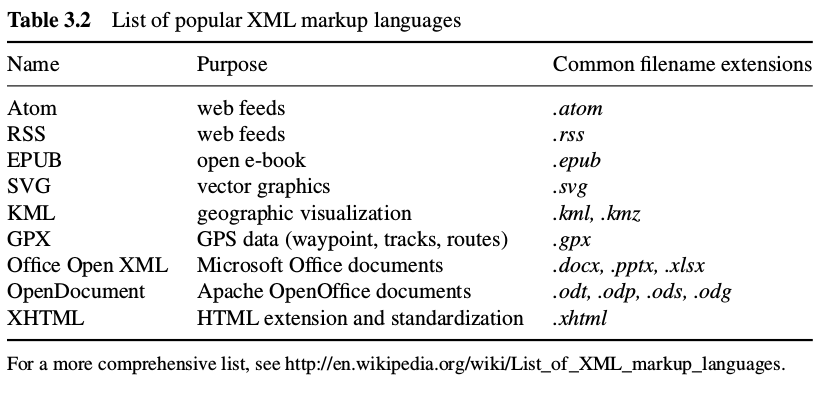
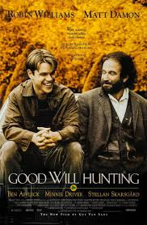
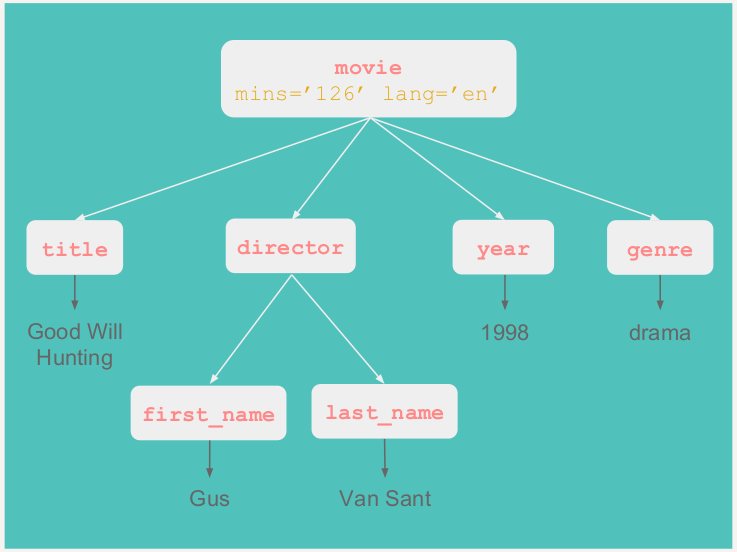
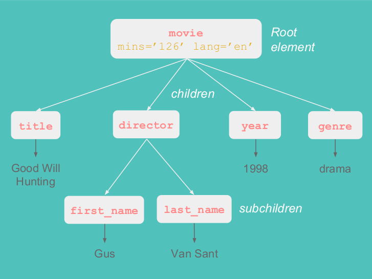

```{r setLicense, child = 'license.Rmd'}
```

```{r disclaimer, child = 'disclaimer.Rmd'}
```

```{r setup, include=FALSE}
require(knitr)
# include this code chunk as-is to set options
opts_chunk$set(comment = NA, prompt = TRUE, tidy = FALSE, fig.width = 7, fig.height = 7,echo = TRUE, message = FALSE, warning = FALSE, cache=FALSE)
Sys.setlocale("LC_TIME", "C")
```

Why you should care about XML and HTML?
=======================================

- Large amounts of data and information are stored, shared and distributed using HTML and XML-dialects
- They are widely adopted and used in many applications.
- Working with data from the Web means dealing with HTML but XML is the syntax of choice for newly designed formats:
     + Mainframes on Wall street trade stocks exchanging XML documents.
     + Children playing in their PCs save their documents in XMl.
     + Sport fans receive real-time game scores in their phones using XML.
- XML is, simply put, one of the most robust,reliable and flexible document syntax ever invented.

So what is XML (they say)
==========================

- *XML is a markup language that defines a set of rules for encoding documents in a format that is both human-readable and machine-readable* 
    + http://en.wikipedia.org/wiki/XML
- *XML is a data description language used for describing data* 
    + Paul Murrell. __Introduction to Data Technologies__
- *XML is a very general structure with which we can define any number of new formats to represent arbitrary data* 
- *XML is a standard for the semantic, hierarchical representation of data* 
    + Deb Nolan & Duncan Temple Lang __XML and Web Technologies for Data Sciences with R__.
    
- XML stands for eXtensible Markup Language and, broadly speaking, *XML provides a flexible framework to create formats for describing and representing data*.


Markups
========

- A __markup__ is a sequence of characters or other symbols inserted at certain places in a document to indicate either:
    + how the content should be displayed when printed or in screen
    + describe the document’s structure.
- A markup language is a system for annotating, i.e. "marking", a document in a way that the content is distinguished from its representation.
- Example markup languages are: LaTeX, PostScript, HTML, SVG.
- In XML (as well as in HTML) the marks (or "tags") are defined using angle brackets: <>

```{r eval=FALSE}
# <mark>Text marked with special tag</mark>
```

eXtensible
===========
- A main characteristic of XML is _extensibility_.
- The concept of extensibility means that __we can define our own marks__, the order in which they occur, and how they should be processed.
- For example:
    + \<my mark\>
    + \<awesome\>
    + \<boring\>
    + \<pathetic\>


What it is and is not
=====================

- XML is NOT
    + a programming language
    + a network transfer protocol
    + a database
    
- XML is
    + more than a markup language
    + a generic language that provides structure and syntax for
representing any type of information
    + a meta-language: it allows us to create or define other
languages

Extensions of XML
=================

- A multitude of extensions of the XML language has been developed that combine 
    + the classical XML features of openness with 
    + the benefits of standardization. 
- In that sense, XML has become an important metalanguage: **it provides the general architecture for other XML markup languages.

<div align="center">

</div>

A minimal example
==================

<div align="center">

</div>

A minimal example
==================

- A minimal XML document must have 
    + A line that makes declarations for the XML document
    + A content embraced by a unique node root.

```{r eval=FALSE}
# <?xml version="1.0" encoding="ISO-8859-1"?>
# <movie>
#   Good Will Hunting
# </movie>
```
- This XML doc has:
    + The header
    + One single element: _movie_
    + A start-tag: `<movie>`
    + An end tag: `</movie>`
    + Content: _Good Will Hunting_

The document header
====================
- The declaration line is compulsory in an XML document and it contains:
    + the version of XML that is being used (1.0 or 1.1)
    + Additionally, the declaration can, but need not hold the character encoding of the document, which in our case is encoding="ISO-8859- 1". 
    + Another attribute the declaration can contain (but does not in our example) is the **standalone attribute**, which take values of "yes" or "no" and indicates whether there are external markup declarations that may affect the content of the document.
    

Improving the example (1)
=========================

- The not-so-simplest XML document:
```{r eval =FALSE}
# <?xml version="1.0" encoding="ISO-8859-1"?>
# <movie mins="126" lang="eng">
#   Good Will Hunting
# </movie>
```

- XML elements can have **attributes**
    + Attributes here are **mins** (minutes) and **lang** (language)
    + Attributes are **attached** to the element's start tag
    + Attributes values must be **quoted**!
    
Improving the example (2)
=========================
```{r eval=FALSE}
# <?xml version="1.0" encoding="ISO-8859-1"?>
# <movie mins="126" lang="en">
# <title>Good Will Hunting</title>
# <director>Gus Van Sant</director>
# <year>1998</year>
# <genre>drama</genre>
# </movie>
```

- an xml element may contain other elements.
- movie contains several elements: **title, director, year, genre**.

Improving the example (3)
=========================

- If one needs more complex items this can be easily solved.
- For example if one needs to have two directors it is solved simply putting two **child** elements ( _first name_ and _last name_) below director.

```{r eval=FALSE}
# <?xml version="1.0" encoding="ISO-8859-1"?>
# <movie mins="126" lang="en">
# <title>Good Will Hunting</title>
# <director>
#   <first_name>Gus</first_name>
#   <last_name>Van Sant</last_name>
# </director>
# <year>1998</year>
# <genre>drama</genre>
# </movie>
```

Conceptual XML
==============

```{r eval=FALSE}
# <Root>
#   <child_1>...</child_1>
#   <child_2>...</child_2>
#     <subchild>...</subchild>
#   <child_3>...</child_3>
# </Root>
```

- An XML document can be represented with a *tree structure*.
- An XML document must have *one single Root* element.
- The Root may contain child elements.
- A child element may contain subchild elements.

XML Tree Structure
==================

<div align="center">

</div>

XML Tree Structure (cont'ed)
============================

<div align="center">

</div>

Well-Formedness
================

- We say that an XML document is __well-formed__ when it obeys the _basic syntax rules_ of XML. 
- Some of those rules are:
    + one root element containing the rest of elements
    + properly nested elements
    + self-closing tags
    + attributes appear in start-tags of elements
    + attribute values must be quoted
    + element names and attribute names are case sensitive
    + Traversing the tree: There’s a unique path from the root node to any given node
    
Document Type Definitions (DTD)
===============================

- The structure of an XML document is arbitrary: tag names and levels of hierarchy *are defined by the user*. 
- However, there is a way to restrict this arbitrariness by
using **Document Type Definitions, DTDs**. 
- A DTD is a set of declarations that defines 
    + the XML structure, 
    + how elements are named, and 
    + what kind of data they should contain. 
    
A DTD for our minimalist example
=================================

A DTD for our minimalist example (the one without nested elements) could look like this:

```{r eval=FALSE}
## <?xml version="1.0" encoding="ISO-8859-1"?> 
## <!DOCTYPE my_movies [ 
## <!ELEMENT my_movies (movie)> 
## <!ELEMENT movie (title,director,year,genre)> 
## <!ELEMENT title (#PCDATA)> 
## <!ELEMENT director (#PCDATA)> 
## <!ELEMENT year (#PCDATA)> 
## <!ELEMENT genre (#PCDATA)> 
## <!ATTLIST movie 
## mins CDATA #IMPLIED 
## lang CDATA #IMPLIED 
## > 
## ]> 
## <my_movies> 
## ... 
## </my_movies> 
```

- For the purpose of web scraping we usually do not need acess to DTDs for parsing HTML, so we do not go into details.
- It is worth knowing about it because it is often the starting pont in an XML application.

XML and R in practice
=======================

<H3>Some references</H3>

- *The XML page in CRAN*
https://cran.r-project.org/web/packages/XML/index.html
- *An Introduction to the XML package for R* http://www.omegahat.net/RSXML/Tour.pdf
- *XML and Web Technlogies for Data Sciences with R*
by Deb Nolan and Duncan Temple Lang.
- *Introduction to Data Technologies*. Paul Murrell https://www.stat.auckland.ac.nz/~paul/ItDT/itdt-2010-11-01.pdf
