```{r setLicense, child = 'license.Rmd'}
```

```{r disclaimer, child = 'disclaimer.Rmd'}
```


Parsing XML content
===================

- Getting data from the web often involves reading and processing content from HTML, but _also from XML documents_.
- The need for parsing XML appears also in a variety of data-exchange-situations such as 
    + reading spreadsheet data,  
    + extracting data from forms in pdf documents.
- The R package "XML" (by Duncan Temple Lang) is the option of choice for this functionality.
- Using the XML package we can *read*, *search*, and *create* XML documents—although we only care about the former two tasks.

```{r}
if (!(require(XML))) install.packages("XML", dep=TRUE)
require(XML)
```

What can be done with the XML?
======================================

- We cover 4 major types of tasks that we can perform with "XML":

1. parsing (ie reading) xml / html content
2. obtaining descriptive information about parsed contents
3. navigating the tree structure (ie accessing its components)
4. querying and extracting data from parsed contents


Parsing XML
==============

- We parse XML for the same reason that we parse HTML documents: *to create a structure-aware representation of XMLfiles that allows a simple information extraction from these files*.
- Similar to what was outlined in the HTML parsing section, the process of parsing XML essentially includes two steps:

1. First, the symbol sequence that constitutes the XML file is read in and used to build a hierarchical tree-like data structure from its elements in the C language, 
2. this data structure is translated into an R data structure via the use of *handlers*.


The `xmlParse()` function
==========================

- The XML package comes with the "almighty"" parser function `xmlParse()` that deeply simplifies the process
- Main input for `xmlParse()` is a file: either a local file, a complete URL or a text string:
    + ex1: xmlParse("Documents/file.xml")
    + ex2: xmlParse("http://www.xyz.com/some file.xml")
    + ex3: xmlParse(xml_string, asText=TRUE)
- the rest of the 20+ parameters are optional, and provide
options to control the parsing procedure.

`xmlParse()` default behavior
==============================

- What does `xmlParse()` do?
- We first consider its __default behavior__.
    + it is a DOM parser: it reads an XML document into a
hierarchical structure representation.
    + it builds an XML tree as a native C-level data structure (not an R data structure)
    + it returns an object of class "XMLInternalDocument"
- Additionally notice that
    + it can read content from compressed files without us needing to explicitly uncompress the file
    + it does NOT handle HTTPS (secured HTTP)

Simple `xmlparse()` usage
===========================
- Simple usage of xmlParse() on an XML document:
```{r}
# parsing an xml document
require(XML)
remoteDoc <- "http://www.xmlfiles.com/examples/plant_catalog.xml"
localDoc  <-"Examples/bond.xml"
doc1 <- xmlParse(localDoc)
```

- `xmlParse()` returns an object of class "XMLInternalDocument" which is a C-level internal data structure
```{r}
# class
class(doc1)
```

About `xmlParse()` (con’t)
=========================

- Instead of parsing content as an internal C-level structure, we can parse it into an R structure by specifying the parameter `useInternalNodes = FALSE`

```{r eval=TRUE}
# parsing an xml document into an R structure
doc2 = xmlParse(localDoc, useInternalNodes = FALSE)
```

- the output is of class "XMLDocument" and is implemented as a hierarchy of lists
```{r eval=TRUE}
# class
class(doc2)
```

Parsing the C tree into R with `xmlTreeParse()`
===============================================

- "XML" provides the function `xmlTreeParse()` as a convenient synonym for `xmlParse(file, useInternalNodes = FALSE)`
```{r}
# parse an xml document into an R structure
doc3 = xmlTreeParse(localDoc)
```
As expected, the output is of class "XMLDocument"
```{r}
# class
class(doc3)
```

Parsing HTML content
======================

- In theory, we could use `xmlParse()` with its default settings to parse HTML documents.
- However `xmlParse()`, with its default behavior, will not work properly when HTML documents are not well-formed:
    + no xml declaration
    + no DOCTYPE
    + no closure of tags


Using `xmlParse()` to parse HTML
=================================

- One option to parse HTML documents is by using `xmlParse()` with the argument `isHTML = TRUE`
```{r}
# parsing an html document with 'xmlParse()'
doc4 = xmlParse("http://www.r-project.org/mail.html",isHTML = TRUE)
```

the output is of class "HTMLInternalDocument"
```{r}
# class
class(doc4)
```


Using `htmlParse()` for HTML content
=====================================

- Another option is to use the function `htmlParse()` which is equivalent to `xmlParse(file, isHTML = TRUE)`
```{r}
# parsing an html document with 'htmlParse()'
doc5 = htmlParse("http://www.r-project.org/mail.html")
```

again, the output is of class "HTMLInternalDocument"

```{r}
# class
class(doc5)
```

Function `htmlTreeParse()`
==========================

- The process of parsing requires transforming the C-level data structure into an R data structure.
- If we are parsing HTML content we can use `htmlTreeParse()` which is equivalent to `htmlParse(file, useInternalNodes = FALSE)`
```{r}
# parsing an html document into an R structure
doc6 = htmlTreeParse("http://www.r-project.org/mail.html")
```
in this case the output is of class "XMLDocumentContent"
```{r}
# class
class(doc6)
```
Notice that it is not the same as the output of `xmltreeparse()` whose type was "XMLDocument"

Parsing Functions Summary (1)
===============================

- `xmlParse(file)`
    + main parsing function
    + returns class "XMLInternalDocument" (C-level structure)
- `xmlTreeParse(file)`
    + returns class "XMLDocument" (R data structure)
    + equivalent to `xmlParse(file, useInternalNodes = FALSE)`

Parsing Functions Summary (2)
===============================

- `htmlParse(file)`
    + especially suited for parsing HTML content
    + returns class "HTMLInternalDocument" (C-level structure)
    + equivalent to xmlParse(file, isHTML = TRUE)
- `htmlTreeParse(file)`
    + especially suited for parsing HTML content
    + returns class "XMLDocumentContent" (R data structure)
    + equivalent to :
        - `xmlParse(file, isHTML = TRUE, useInternalNodes = FALSE)`
        - `htmlParse(file, useInternalNodes = FALSE)`

Working with parsed documents
==============================

- Once we have parsed the document and turned it into an R (tree) data structure, we can navigate through it to extract or analyze its content.
- We can use 2 main functions to start working on the tree structure:
    + `xmlRoot()` gets access to the root node and its elements
    + `xmlChildren()` gets access to the child elements of a given node
    
Conceptual diagram
===================

<div align="center">
  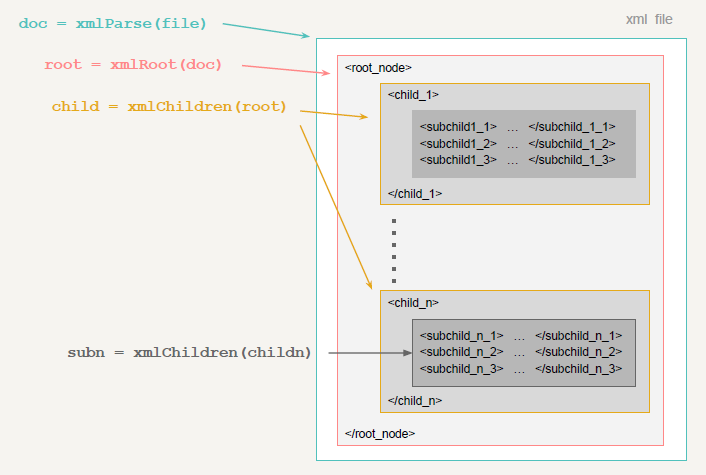
</div>

Additional functions
===================

<div align="center">
Functions for a given node
  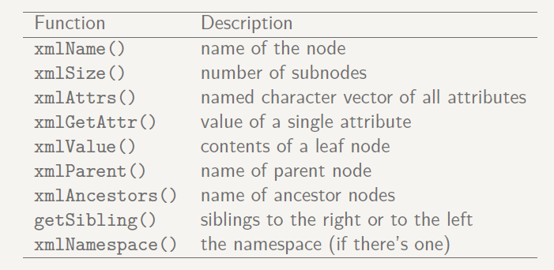
</div>

An example: Movies XML
=======================
- File "http://www.r-datacollection.com/materials/ch-3-xml/bond.xml", also available at "Examples/bond.xml" contains an XML document with information on movies with a structure _similar_ to the one used in the examples.
- As described, we start reading the file:

```{r}
require(XML)
url<- "http://www.r-datacollection.com/materials/ch-3-xml/bond.xml"
movies_xml <- xmlParse(url)
```

What we have read
==================

```{r}
movies_xml
```

Movies XML: Root Node
======================

- We can examine the object's class
- Next we extract the __root__ node (remember, there may only be only one root node).

```{r}

# (movies_xml is a C-level object)
class(movies_xml)
# get root node
root <- xmlRoot(movies_xml)
class(root)
```

Display root node
==================
- Take a look at what the root node contains (everything!)

```{r}
root
```

Now the child nodes
=====================

```{r}
movie_child = xmlChildren(root)
movie_child
```

A single child node
====================

- We can access any node if we understand the structure.
```{r}
(secondMovie<-movie_child[[2]])
```

Information about nodes
========================
- We can use a variety of functions to extract the information we need.

```{r}
xmlName(secondMovie) # node name
xmlSize(secondMovie) # number of children
xmlAttrs(secondMovie)
getSibling(secondMovie)
```

Looping over nodes
===================

- Extracting data from an XML / HTML document involves applying a given function to a subset of nodes. 
- This means iterating over such subset.
- There are various ways to loop over a subset of nodes:
    + the most basic approach is with `sapply()` or `lapply()`
    + anoter way is by using the ad-hoc functions `xmlApply()` and `xmlSApply()`, which are simple wrappers for the `lapply()` and `sapply()` functions.
    
Some iteration examples
=========================

```{r}
sapply(movie_child, length)
sapply(movie_child, names)
sapply(movie_child, xmlAttrs)
```

xmlApply() and xmlSapply()
===========================

- These are wrapper functions that operate on the subnodes of the XML node
```{r}
xmlSApply(root, names)
xmlSApply(root, xmlSize)
xmlSApply(root, xmlAttrs)
xmlSApply(root, xmlValue)
```

xmlApply() and xmlSapply() (Cont'd)
=======================================


```{r}
xmlSApply(root[[1]], length)
xmlSApply(root[[1]], xmlSize)
xmlSApply(root[[1]], xmlValue)
```

The XPATH language
====================
- The **real power of parsing** comes from the ability to 
    + *locate* nodes and 
    + *extract* information from them.
- For this, we need to be able to perform queries on the parsed content.
- The solution is provided by XPATH, which is __a language to navigate through elements and attributes in an XML/HTML document__

XPATH syntax
=============

- XPATH uses __path expressions__ to select nodes in an XML document. 
- It has a computational model to identify sets of nodes (node-sets) XPATH Syntax.
- We can specify paths through the tree structure:
    + based on node names
    + based on node content
    + based on a node’s relationship to other nodes
    
Writing XPATH sentences
========================

- The key concept is knowing to write XPATH expressions.
- XPATH expressions have a syntax similar to the way files are located in a hierarchy of directories/folders in a computer file system. 
- For instance, the XPATH expression to locate the first movie element _that is the child_ of the movies element the syntax is:

```{r eval=FALSE}
/movies/movie[1]
```
 
XPATH main expressions
========================

- The main path expressions (ie symbols) are:

<div align="center">
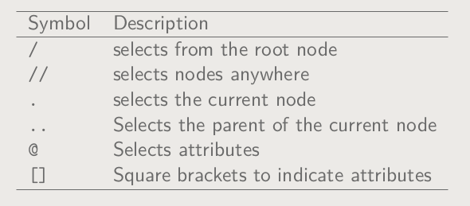
</div>

XPATH wildcards
========================

- XPATH wildcards can be used to select unknown XML elements

<div align="center">
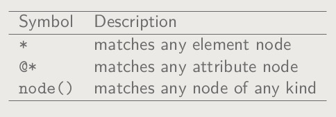
</div>

Movies Tree structure
======================

<div align="center">
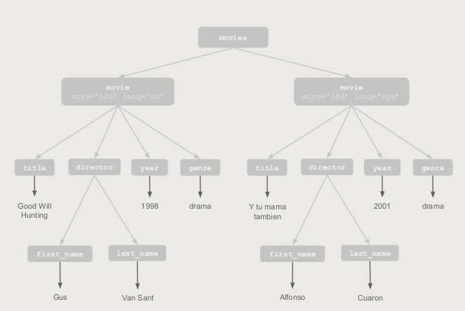
</div>

XPATH: movie nodes
====================

<div align="center">
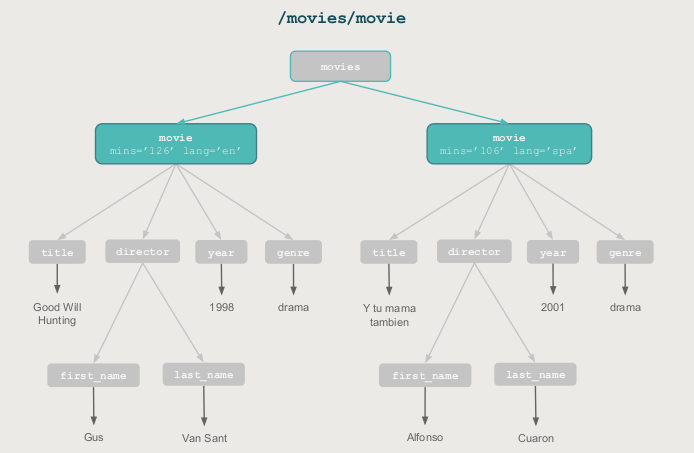
</div>

XPATH: movie title nodes
=========================

<div align="center">
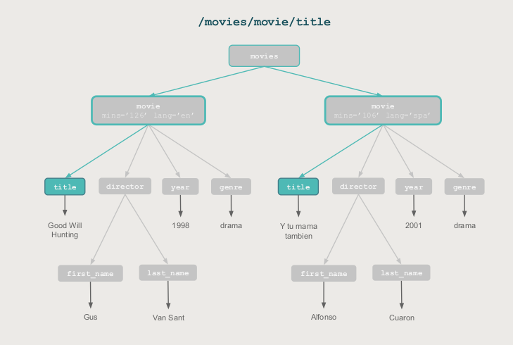
</div>

XPATH: movie director's first name nodes
=========================================

<div align="center">
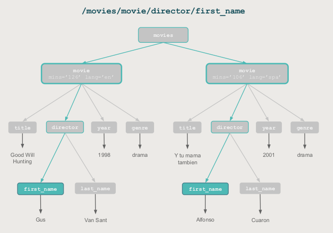
</div>

XPATH: movie director nodes
=========================================

<div align="center">
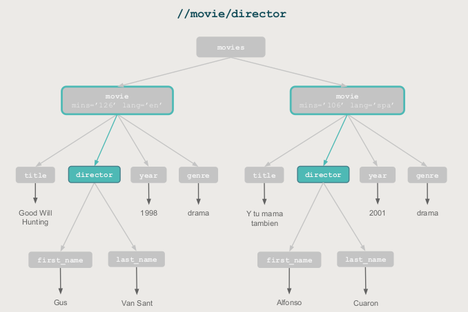
</div>

XPATH: last name nodes
=========================================

<div align="center">
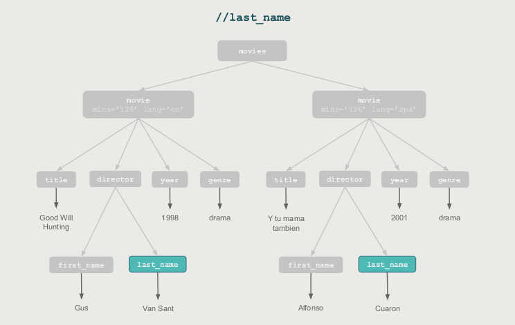
</div>

XPATH: title node of movie in Spanish
=========================================

<div align="center">
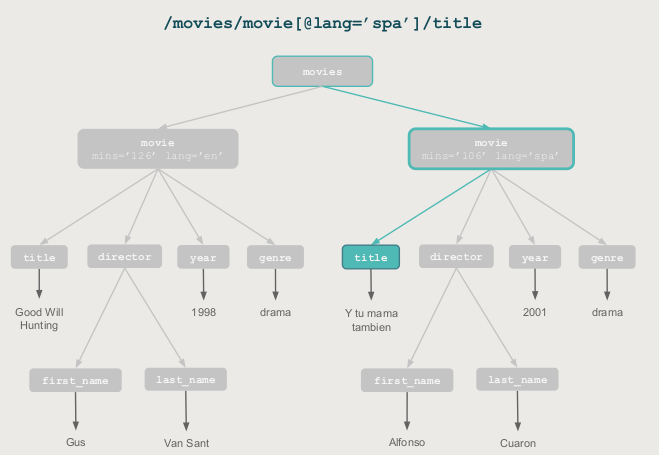
</div>


Querying parsed documents
==========================

- To work with XPATH expressions using the "XML" package, we have the auxiliary function `getNodeSet()` that accepts XPATH expressions in order to select node-sets. 
- Its main usage is: 
```{r eval=FALSE}
getNodeSet(doc, path)
```
- where 
    + "doc" is an object of class "XMLInternalDocument" and 
    + "path" is a string giving the XPATH expression to be evaluated

XML Movies example
===================

```{r}
# define some xml content
xml_string = c(
'<?xml version="1.0" encoding="UTF-8"?>',
'<movies>',
'<movie mins="126" lang="eng">',
'<title>Good Will Hunting</title>',
'<director>',
'<first_name>Gus</first_name>',
'<last_name>Van Sant</last_name>',
'</director>',
'<year>1998</year>',
'<genre>drama</genre>',
'</movie>',
'<movie mins="106" lang="spa">',
'<title>Y tu mama tambien</title>',
'<director>',
'<first_name>Alfonso</first_name>',
'<last_name>Cuaron</last_name>',
'</director>',
'<year>2001</year>',
'<genre>drama</genre>',
'</movie>',
'</movies>')
```

Parse content and query parsed content
========================================

```{r eval=FALSE}
movies_xml = xmlParse(xml_string, asText = TRUE)
# movies_xml
getNodeSet(movies_xml, "/movies/movie")
getNodeSet(movies_xml, "//movie")
getNodeSet(movies_xml, "//title")
getNodeSet(movies_xml, "//year")
etNodeSet(movies_xml, "//director")
getNodeSet(movies_xml, "//movie[@lang='eng']")
getNodeSet(movies_xml, "//movie[@lang='spa']")
```

Your turn now!
===============

- The XML file "Examples/potus.xml" (downloaded from ADCR site http://www.r-datacollection.com/materials/ch-3-xml/) contains biographical information on US presidents. Parse the file into an object of the R session.

(a) Extract the names of all the presidents.
(b) Extract the names of all presidents, beginning with the 40th term.
(c) Extract the value of the <occupation> node for all Republican presidents.
(d) Extract the <occupation> node for all Republican presidents that are also Baptists.
(e) The <occupation> node contains a string with additional white space at the
beginning and the end of the string. Remove the white space by extending the
extractor function.
(f) Extract information from the <education> nodes. Replace all instances of “No
formal education” with NA .
(g) Extract the <name> node for all presidents whose terms started in or after the year
1960.

